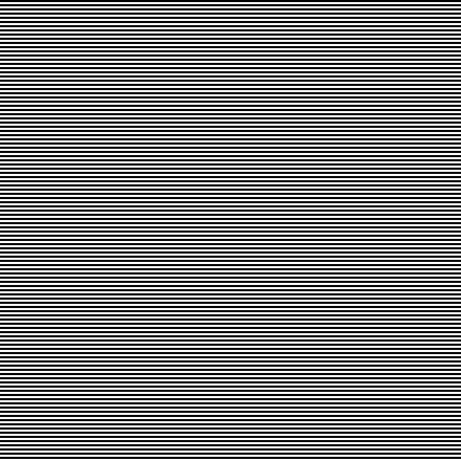
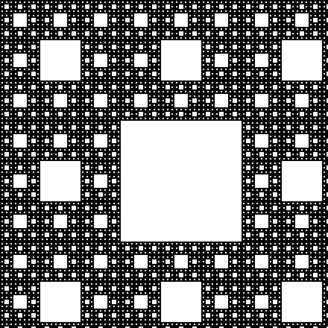
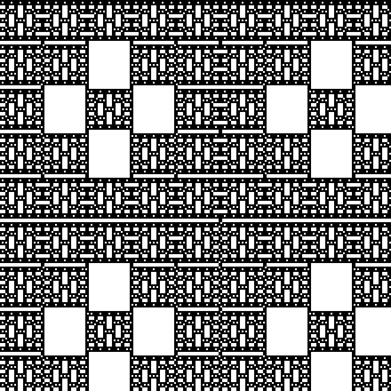
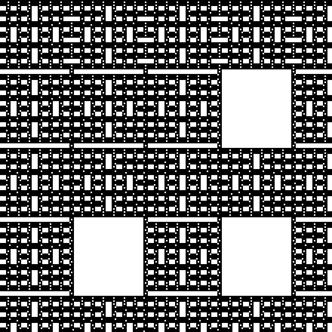

# Delannoy Tools

Interactive and CLI tools for exploring Delannoy-number carpets and exporting visual patterns.

> This project was developed as part of summer research at **Kansas State University (KSU)**. More functionalities are coming soon!

## What this project does

This repo contains two Java programs:

- `DelannoyMatrixMenu.java`
  - Console app to generate Delannoy matrices.
  - Supports modulus mode (`p`) and PNG export.
  - PNG rule: cells with value `0` use the “zero color”; non-zero cells use the “non-zero color”.

- `DelannoyLiveViewer.java`
  - Live GUI viewer with sliders for:
    - size
    - `k`
    - modulus `p`
    - zoom
  - Color pickers for:
    - value `0`
    - value `!= 0`
  - Streams updates while parameters are changing.

## Run

From this folder:

```bash
javac DelannoyMatrixMenu.java DelannoyLiveViewer.java
java DelannoyLiveViewer
```

Or run the CLI menu:

```bash
java DelannoyMatrixMenu
```

## Gallery (fun mod patterns)

### mod = 2, k = 1



### mod = 3, k = 0



### mod = 5, k = 2



### mod = 7, k = 3



## Notes

- Some parameter pairs can produce mostly one color (for example, specific parity behavior with `p = 2`).
- For richer visual carpets, try larger `p` values like `3`, `5`, or `7` and vary `k`.
